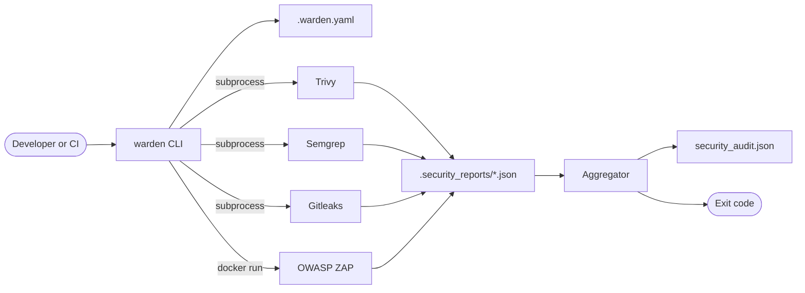

# Architecture overview

Warden runs four third-party scanners, converts their output to one format, and
returns one exit code. It does not analyze the project itself.

## System context

The three static scanners run as subprocesses against the filesystem. ZAP is
different: it is a container launched through the Docker daemon, and it needs a
running application rather than source files.

## Components

All under `src/warden/`.

| Module | Responsibility |
| --- | --- |
| `cli.py` | Entry point. Parses arguments, sequences the stages, prints progress, returns the exit code. |
| `config.py` | Parses `.warden.yaml` and resolves it against CLI arguments into a `ResolvedConfig`. Also the `warden-config` entry point. |
| `tooling.py` | Prepares the report directory, runs a scanner's command line through a `CommandRunner`, and filters a report against `exclude_dirs` for a scanner that cannot skip paths. The only module that touches subprocesses. |
| `aggregate.py` | Assembles the report from the parsed findings and writes it. Also the `warden-aggregate` entry point. |
| `_parsers.py` | Turns each tool's JSON into `Finding` records and normalises severities. |
| `_summary.py` | Creates a `Verdict` with counts, a category breakdown, and the build result, then prints its terminal table. |
| `_json.py` | Type-narrowing helpers for walking untrusted JSON. A file it cannot parse comes back as an error, not a printed warning. |
| `_scanners.py` | One `Scanner` record per tool Warden knows about, the registry of them, and the code that builds each one's command line. |
| `_models.py` | Shared dataclasses, typed dicts, and constants. No logic. |

The dependency direction is one-way: `cli` depends on `config`, `tooling`, and
`aggregate`, which do not depend on each other. Every module that needs to know
which scanners exist reads `_scanners`, which depends on `_parsers` because each
record carries its tool's parser. `aggregate` depends on `_parsers` and
`_summary`; those depend on `_json`. `_models` imports no other package modules
and contains no behavior. Records with derived properties live with the code
that uses them. This puts `Verdict` in `_summary.py` and `Scanner` in
`_scanners.py`.

`aggregate.py` once contained the parsing, rendering, and JSON-reading code.
Those parts moved to separate modules when they began changing independently.

## Data flow through a scan

1. **Resolve configuration.** `config.resolve_config` reads `.warden.yaml` if
   present and merges it with CLI arguments. A missing or
   unparsable file yields defaults, and so does a `.warden.yaml` in the project
   that is not a regular file (a named pipe, say).
2. **Prepare the report directory.** `.security_reports/` is created in the
   project root, and appended to `.gitignore` if that file exists and does not
   already list it. Any report left by a previous run is deleted, so a tool that
   is now disabled or that crashes cannot contribute stale findings. A symlink
   (or, for the report, a named pipe) at any of these paths is replaced or left
   alone, never followed, because the project being scanned is not trusted.
3. **Run each enabled tool.** Each writes its native JSON into the report
   directory. Gitleaks has no flag for skipping paths, so `tooling` then drops
   the findings under `exclude_dirs` from its report. A tool that is missing or
   fails produces a warning; the sequence continues regardless.
4. **Aggregate.** Each report file that exists is parsed into a common `Finding`
   record and severities are normalised onto one scale.
5. **Report and exit.** Findings are sorted by severity, written to
   `security_audit.json`, judged into a verdict, and summarised as a table. The
   verdict becomes the exit code.

The stages communicate through files on disk, not in memory. That is why
`warden-aggregate` can run standalone against a directory of reports that some
other process produced.

## Design notes

### Failure is non-fatal by default

A scanner that is missing or crashes does not abort the run or fail the build.
This allows Warden to return results from the scanners that completed. It also
means that a green build does not prove every scanner ran. `tools_run` records
which report files Warden found.

Warden handles an unreadable report the same way. This can happen when a tool
crashes while writing the file. `load_json` returns a `LoadedJson` containing
either the parsed data or the read error. It does not print to the terminal, so
tests can assert on the error value. `aggregate` prints the error because it
iterates over `SCANNERS` and knows which scanner owns the file. Warden omits the
scanner's findings and name from `tools_run`, then continues.

### Only Critical and High fail the build

`DEFAULT_FAIL_ON_SEVERITIES` is `("CRITICAL", "HIGH")`. The threshold is a fixed
constant that nothing in the CLI or config file exposes. Lower severities are
still collected and reported.

`_summary.judge` reads that constant and returns a `Verdict` with the failing
severities, counts, and table breakdown. `Verdict.failed` derives its value from
the failing severities, so the exit code and the `PASS` or `FAIL` line use the
same decision. `aggregate.generate_report` returns the verdict, and
`cli.run_audit` converts it to an exit code. `_summary.print_summary` only
renders the verdict. Tests can therefore check the result without rendering the
table.

Gitleaks findings are always assigned `CRITICAL`, so any detected secret fails
a build. Semgrep's `ERROR` maps to `HIGH`, so those findings also fail a build. See
[Report format](../reference/report-format.md#severity-normalisation).

### The config parser is deliberately minimal

About 110 lines of code parse `.warden.yaml` without a YAML library. This keeps
the runtime dependency list to `rich` and `semgrep`, but supports only the
documented shapes. The parser ignores unsupported syntax, so a malformed config
can silently produce the defaults. Use `warden-config` to inspect the resolved
configuration.

### One record per scanner

Everything Warden knows about a scanner is one `Scanner` record in
`_scanners.py`. The record contains its display label, report filename, summary
category, summary position, parser, command builder, accepted exit codes,
whether it needs a target URL, and, for a scanner with no flag to skip paths,
the report key that holds each finding's file path. Warden derives the `.warden.yaml` key from the
label instead of storing both values. The constructor rejects a label that
cannot be converted to a valid key.

`SCANNERS` stores those records in report order. Code that needs a scanner list
reads this registry. This includes report cleanup, CLI stages, aggregation,
`tools_run`, recognized config keys, summary categories, and display order. To
add a scanner, add its record, parser, and command builder. No other package
code enumerates the tools.

Display order in the summary breakdown is deliberately not report order
(`Secrets, Code, Deps, ZAP` instead of `Trivy, Semgrep, Gitleaks, ZAP`). Each
record carries a `summary_order`, and sorting that field produces
`CATEGORY_ORDER`. The code does not maintain a second list by hand.

### Commands reach the operating system through a runner

`run_scanner` does not call `subprocess` directly. It takes a `CommandRunner`,
which receives the arguments, working directory, environment overrides, and
stderr settings, then returns a `CommandResult`. `cli.py` passes
`tooling.run_subprocess` in production. Tests pass a fake that records each
call. This lets the tests cover ZAP arguments and host-path resolution without
Docker.

Every scanner goes through that one function, ZAP included. `run_scanner` asks
the record for its `Command`, which contains the argument vector, working
directory, and process settings. It then passes the command to the runner.
Dispatch needs no per-tool branch or separate runner table.

### ZAP runs as a sibling container

The other three tools are executables on `PATH`. ZAP is invoked as
`docker run ... ghcr.io/zaproxy/zaproxy:stable`, which has two consequences.

First, Docker is a hard prerequisite of both installers even though only the
DAST stage uses it.

Second, when Warden is *itself* containerised, the report path it wants to
mount is a path inside its own container, which the host's Docker daemon cannot
resolve. The `WARDEN_HOST_REPORT_DIR`, `WARDEN_HOST_WORKSPACE`, and
`GITHUB_WORKSPACE` environment variables exist to supply the host path instead.
This is the reason the GitHub Action passes `GITHUB_WORKSPACE` through.

ZAP's record sits in the registry with the other three. Its command takes a
target URL instead of a project root and uses the report directory as its
working directory. The CLI handles this stage separately.

### The container runs unprivileged

The image runs as UID 10001 rather than root. Because callers are expected to
override the UID with `--user` to match the owner of the mounted project, the
image cannot rely on a fixed home directory. Scanner caches and settings live
under a world-writable `/var/tmp/warden`, and `safe.directory` is set
system-wide so Gitleaks can read a repository owned by another user.

### Wrappers exist for source checkouts

`bin/` holds shell, PowerShell, and batch wrappers that locate the project root
and delegate to the installed CLI, preferring `uv run` and falling back to
`python -m warden`. They exist so the tool is runnable from a plain checkout
without installation. They add no behaviour of their own.

## Current limitations

The current design has these limitations:

- **No incremental or diff-aware scanning.** Every run scans the whole tree.
- **No severity policy per tool.** You can disable a tool entirely, but you
  cannot say "fail on Trivy High but not Semgrep High".
- **No suppression mechanism.** There is no allowlist or baseline file, so a
  finding you have accepted will fail every subsequent build. Excluding the
  containing directory is the only lever, and it is a blunt one.
